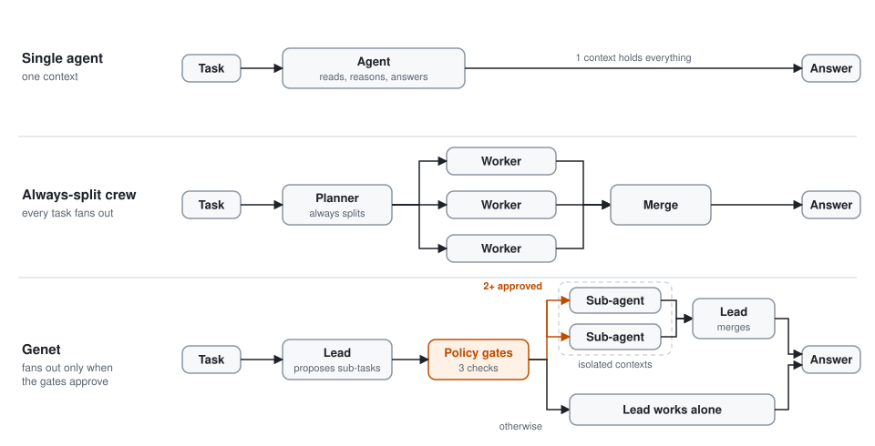
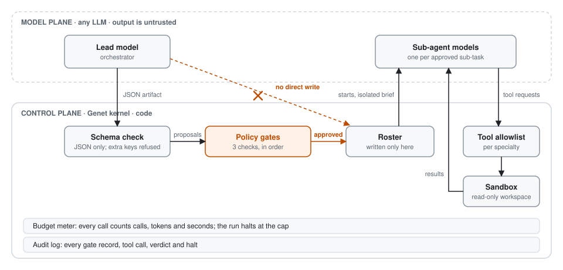
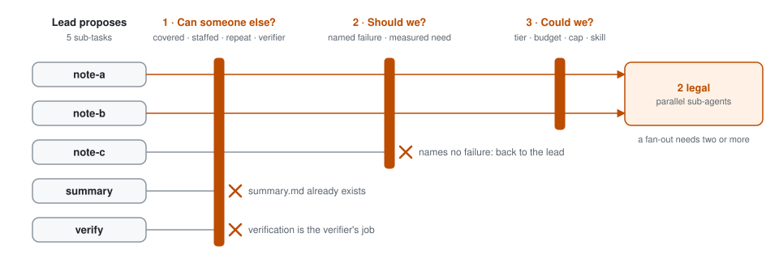

# Genet

[Apache-2.0](LICENSE) · Python 3.11+ · kernel, not a cloud · [Website](https://jrodriguez4505.github.io/Genet/)

One organism. Many stems.

**The question is not how many agents you can run. It is whether a second one is doing new work.**

Genet is a small multi-agent runtime. Most stacks treat headcount as capacity; Genet treats it as a cost. A task starts with one lead agent (the orchestrator). The lead may propose sub-agents, each with the skill its sub-task needs, and policy gates in code decide whether any of them run. Default is a single agent. Authority lives in the graph, not in the prompt.

<picture>
  <source media="(prefers-color-scheme: dark)" srcset="docs/img/patterns-dark.svg">
  
</picture>

*Same task, three ways to staff it. A crew fans out on every task. Genet's lead proposes, and the gates decide whether a fan-out happens at all.*

The team is small, and every agent can switch skills, with specialists added only when a sub-task needs one. The lead owns the roster. The goal stays fixed while the method changes. Work fans out to sub-agents only when the task has independent parts, then merges back.

Quality of process over quantity of agents: possibly more efficient, and possibly more effective. That stays a claim until measured. `taskorg compare` exists to measure it (see [Proving it](#proving-it)).

## What it refuses

- Org-chart roleplay as architecture
- Workers that spawn workers
- `could we` as the first question
- Staying on a dead plan because the team looks aligned
- Unbounded loops

## Who decides what

<picture>
  <source media="(prefers-color-scheme: dark)" srcset="docs/img/control-dark.svg">
  
</picture>

*Models propose; code disposes. Nothing a model writes reaches the roster, the tools or the budget without passing a check in code, and every decision lands in the audit log.*

Models only fill a fixed JSON artifact: `claim`, `evidence`, `uncertainty`, `channel_id`, `context_update`, `requests`. Any other key is rejected. The lead proposes sub-agents as `requests` entries like `subtask:<channel>@<skill>=<named_failure>`. It cannot write the roster.

A run has four steps:

1. **Read and propose.** The lead reads the context and proposes sub-tasks, or none.
2. **Judge.** The gates decide. Two or more legal sub-tasks run as parallel sub-agents, each blind to the others, and the lead merges their results. Otherwise a single agent does the work, switching to whatever skill the job needs.
3. **Verify.** If the product fails and the budget tier allows, the lead requests a replan, changes the method and reworks once.
4. **Answer from the record.** The operator's question is answered from the gate record, and the run closes. A closed run is read-only.

## Gates

Every proposed sub-task goes through three gates in order, and they fail closed: **can someone else → should we → could we.** In industry terms this is admission control for sub-agents. Each proposal gets a full gate record, legal or not.

<picture>
  <source media="(prefers-color-scheme: dark)" srcset="docs/img/gates-dark.svg">
  
</picture>

*Refused work is either already covered or goes back to the lead; it is never silently dropped.*

| Gate | Refuses a sub-task when |
|---|---|
| Can someone else | A file or channel in the world already covers it, the channel is already staffed, it repeats another proposal, or it is verification (the verifier's job). A single open sub-task is the lead's job, not a new agent's. |
| Should we | It names no failure: what goes wrong if a single agent does it. Then, for the team: there is no measurable reason a single agent would fail. A fan-out needs one of two reasons: the operator declared that the sub-tasks must stay isolated (`--isolate`), or their material does not fit in half of one call's context. Material is estimated from the sizes of the workspace files each sub-task covers. If the material can't be measured, it doesn't count as a reason. |
| Could we | Its skill is unknown, or its channel id is unusable or reserved. The budget tier does not allow a fan-out. The budget cannot pay for the sub-agents plus merge and verify. The cap of 4 workers is full. |

A fan-out needs at least two legal sub-tasks.

That second check makes the gate measurable rather than rhetorical. The lead can no longer split work just by giving a reason. `--split-policy stated` restores the old behavior, where the lead's named reasons are enough; it is kept for comparison. Fan-outs the operator names with the `fanout` command count as declared.

When the plan no longer fits, request a replan and change the method. `KEEP_ROSTER` is illegal on a replan request; use `CHANGE_METHOD` or `REVISE_GOAL`.

## Skills and tools

Every slot carries one active skill. The lead can switch its own. A sub-agent is created with the skill its sub-task names, which makes it a specialist. Each skill has its own brief and tool allowlist, and can have its own model.

| Skill | Tools | Brief |
|---|---|---|
| `execute` | — | Do the assigned piece of work. |
| `retrieve` | `retrieve`, `read` | Find source material; cite paths and lines. |
| `observe` | `observe`, `read` | Survey what exists. |
| `reason` | — | Work the problem through. |
| `draft` | — | Write the product. |
| `simulate` | — | Run the plan forward; report where it breaks. |
| `verify` | — | Judge the product: PASS or FAIL. |

The tools only read: `read:<path>`, `retrieve:<query>` and `observe[:<dir>]`. They reach only the `--workspace` directories and the `--read` files. Hidden files, binaries and symlinks that lead outside are refused. The allowlist is checked before any tool runs, and each tool round is a budgeted call (at most 2 rounds per sub-agent).

## Budget tiers

| Tier | Flag | Allowed | Cap |
|---|---|---|---|
| Tight | `--tier tight` | single agent | 4 calls / 4k tokens / 30s |
| Normal | `--tier normal` | + replan | 8 / 15k / 60s |
| Open | `--tier open` | + gated fan-out | 12 / 50k / 120s |

The CLI defaults to tight. Do not raise the budget because the model sounded ready. A run may spend its whole budget, but not one call more.

## Install

```bash
git clone https://github.com/jrodriguez4505/Genet.git
cd Genet
python3 -m venv .venv && . .venv/bin/activate
pip install -e ".[dev]"
pytest -q
```

## Commands

```bash
# The lead staffs the task.
python -m taskorg.cli run --context "One paragraph holds everything needed."

# Two notes. If they fit one context, the gates keep a single agent and say why.
# --isolate declares they must not share a context, so the gates allow a fan-out.
python -m taskorg.cli run --tier open --workspace notes/ \
  --context "subtask:note-a@retrieve=sources_must_not_mix subtask:note-b@retrieve=sources_must_not_mix"
python -m taskorg.cli run --tier open --workspace notes/ --isolate \
  --context "subtask:note-a@retrieve=sources_must_not_mix subtask:note-b@retrieve=sources_must_not_mix"

# Fixed paths: the operator picks the shape.
python -m taskorg.cli single --tier tight
python -m taskorg.cli replan --tier normal
python -m taskorg.cli fanout --tier open --context "subtask:source-a=independent_a subtask:source-b=independent_b"

# Read a saved run.
python -m taskorg.cli diagnose data/runs/run-001.json
python -m taskorg.cli board data/runs/run-001.json
python -m taskorg.cli bench
```

Every run command takes these flags:

- `--goal`, `--purpose`, `--done-when` and `--context`: what the run is for, and what is known.
- `--read FILE`: file text goes into working memory.
- `--workspace DIR`: specialists may read and search here.
- `--exists FILE`: the file's name covers a channel.
- `--criteria TEXT`: the product must show this.
- `--isolate`: the sub-tasks must not share a context, which is a declared reason to fan out.
- `--split-policy measured|stated`: what "should we" accepts (default `measured`).
- `--tier`, plus budget overrides: `--max-calls`, `--max-tokens`, `--max-seconds`, `--max-tokens-per-call`.

Each run starts with clean working memory, even when you reuse a run id. Runs saved before the 0.2 rename still load.

`bench` scores every fixture in `fixtures/bench/` against its `expect` block.

## Proving it

`compare` runs the same tasks three ways. Model, tools, budget, tool rounds, verify-and-replan step and concurrency are all the same; only how the task is staffed differs.

| Strategy | Staffing |
|---|---|
| `single` | One agent works the task. No planning call. |
| `always` | Crew style: the lead always decomposes, and every sub-task gets a worker. |
| `genet` | The lead proposes sub-agents and the gates judge them, with the measured "should we". |
| `genet-stated` | Same, but the lead's stated reasons are enough. Add it with `--strategies single,always,genet,genet-stated`. |

The tasks come from a seeded, synthetic corpus of company operating notes, so ground truth is exact and no model has seen it. Facts are written in varied prose and surrounded by distractors: prior-year figures and look-alike company names.

| Family | Question | Stresses |
|---|---|---|
| `lookup` | One figure for one company | One source holds everything needed |
| `aggregate` | Sum of a figure over 3 companies | Independent parts |
| `compare` | Which of a look-alike pair had higher churn | Interference |
| `breadth` | Which of 5 companies had the highest revenue | Many sources |

The claim under test: genet matches the better baseline's accuracy at close to single-agent cost. The report shows accuracy, tokens, calls, latency, split rate and aborts, overall and per family, plus cost when you give prices.

```bash
python -m taskorg.cli compare --dry-run                     # the plan and call ceiling; calls no model
python -m taskorg.cli compare --adapter sim                 # deterministic reader: structural cost at $0
python -m taskorg.cli compare --adapter live --per-family 2 # pilot: 24 trials
python -m taskorg.cli compare --adapter live --price-in 2 --price-out 10   # full: 60 trials, with cost
```

The `sim` adapter is a deterministic reader, not a language model. It solves every task under every strategy, which shows the harness gives each strategy the facts it needs. Its token counts show what each strategy costs by structure alone. With a perfect reader, splitting never pays: a single agent is cheapest in every family. Splitting can only earn its cost if a real model reads worse with everything in one context. The live run is what measures that.

What the simulated reader shows. These are structural results from a perfect reader, not model results:

| Per-call context | Single agent | Always-split crew | Genet |
|---|---|---|---|
| Roomy, `--context 16000` | 100% · 1,913 tokens/task | 100% · 3,503 | 100% · 2,284 (1.19× single) |
| Tight, `--context 1500` | **55%**: runs abort on context overflow | 100% · 3,503 | 100% · 3,304 (0.94× crew) |

When the work fits one context, Genet stays a single agent and pays only for its planning call. When it doesn't fit, a single agent fails, and Genet fans out exactly where the material requires it. Whether real models also read worse with everything in one context, which is the other reason to split, is what the live run measures.

The stub adapter drives the harness end to end but cannot answer, so its accuracy is 0 by design. Results are saved to `data/compare/` as JSON. No live results are published yet.

## Live model (optional)

Any OpenAI-compatible chat endpoint:

```bash
export TASKORG_MODEL_BASE=https://api.x.ai/v1
export TASKORG_MODEL_KEY=...
export TASKORG_MODEL_NAME=...                 # required
export TASKORG_MODEL_NAME_REASON=...          # optional: a model per skill
python -m taskorg.cli run --adapter live --tier normal --context "..."
```

## Verification

The verifier's claim must start with PASS. Then every success criterion must appear in the product itself: its claim, evidence or context update. The verifier's own evidence does not count, so it cannot pass a product by echoing the criteria. These run-state checks must also hold:

- The context and the method are not empty.
- Sub-agents merged their results.
- No review is open.

## Diagnose

`diagnose` reports health, the budget used and remaining, and every gate verdict and tool call. It also reports isolation: whether any sub-agent's brief carried another sub-agent's result. That is checked at call time over the whole brief, and the verdict survives save and load.

These count as fails:

- A tight-tier run that grew the roster.
- A normal-tier run that answers a replan request with `KEEP_ROSTER`.
- Any run with `isolation_leak`.

Runs saved before isolation was recorded show `isolation_unverified`.

## Tests

`pytest -q` runs about 550 checks with no network and no key:

- **Kernel rules and regressions.** Each rule, and each bug fixed so far, has a test that fails if it comes back.
- **Red team.** Hostile model output must be refused, contained or halted: authority keys, spawn requests, path escapes, instructions planted in workspace documents, channel spoofing, proposal floods, oversized output.
- **Fuzzing.** 300 random sequences of 40 calls from random actors. The roster rules hold after every call.
- **Concurrency.** Parallel sub-agents never lose, double-count or cross results, and a tight budget is never overspent.
- **Live adapter.** Driven against a fake OpenAI-compatible endpoint: prompts, usage accounting, HTTP errors, timeouts.
- **Harness validity.** The deterministic reader gets every task right under every strategy.
- **Compatibility.** Runs saved in older formats still load.

`python scripts/mutation_check.py` checks the tests themselves. It breaks one rule at a time, across 57 hand-picked mutations of the gates, roster, budget, verifier, isolation, sandbox and model-output checks, and confirms that some test fails for each. All 57 are caught.

## Terms

| Term | Meaning | In code |
|---|---|---|
| Lead | The orchestrator. The only agent that proposes changes to the team. | `lead` slot, `RunState.lead_id` |
| Roster | Who is on the team (agent topology). | `RunState.slots`, `Run.set_roster()` |
| Sub-agent | A worker with an isolated context and one channel. | `worker` slot with a `channel_id` |
| Sub-task | A part of the work with a stated reason to run separately. | `Subtask`, `subtask:<channel>@<skill>=<failure>` |
| Gates | Admission control for sub-agents. | `gates.assess()`, `GateRecord` |
| Split policy | What counts as a reason to fan out: measured (default) or stated. | `Engine(split_policy=...)`, `--split-policy` |
| Skill | A role brief plus a tool allowlist. | `Slot.skill`, `SKILLS`, `Run.switch_skill()` |
| Goal | What the run must deliver, with success criteria and a done-when condition. | `goal`, `success_criteria`, `done_when` |
| Method | The current plan. | `RunState.method`, `axes` |
| Context | The shared state of what is known. | `RunState.context`, `Run.update_context()` |
| Review | A concern raised to the lead, which must answer it. | `Run.open_review()`, `Run.answer_review()` |
| Replan request | A review that says the plan no longer fits; only a method or goal change closes it. | `Run.request_replan()`, INV-14 |
| Run log | The trace and audit log of every decision. | `Run.log`, `diagnose()` |
| Streams | Typed message channels: merge, escalate, report, peer. | `STREAMS`, `Delta.stream` |
| Budget tier | Tight, normal or open. | `Budget.for_tier()` |

This Genet is software, not the playwright.

## Status

v0.3 kernel. Invariants and the bench are covered by tests. The comparison harness exists; live results do not yet. Not a cloud platform.

The policy head (`policy.py`, `imitate.py`, `rl.py`, `finetune.py`) is an experiment and is not wired into runs. See [COMPLETED.md](COMPLETED.md) for what is and is not claimed.

## Use, partnerships, commercial

Use it. Fork it. Ship a product on top of it.

That is the point of an Apache-2.0 kernel. You do not need permission to run Genet or to build with it.

If you want any of the following, open a GitHub issue with the label `partnership` (or email the address on the GitHub profile):

- embed Genet in a paid product and want a support or OEM conversation
- co-develop a harness, adapter, or evaluation set
- write about the design and want a review for accuracy
- hire the author for integration work

Sales of *your* product that uses Genet are yours. Sales of *this* kernel as a hosted service, or use of the name Genet as your product name, need a conversation first. See `NOTICE`.

Do not file an issue to ask whether you may use the code. You may. File an issue when you want a person on the other end.

## License

Apache License 2.0. Copyright 2026 John Rodriguez.

You may use, modify, and distribute, including in commercial products. You keep your own copyright on your changes. You must keep the license and notice. The license does **not** grant trademark rights to the name Genet.

This is not legal advice. If you need a different deal (exclusive, support SLA, assignment), that is a contract, not a license dropdown.
